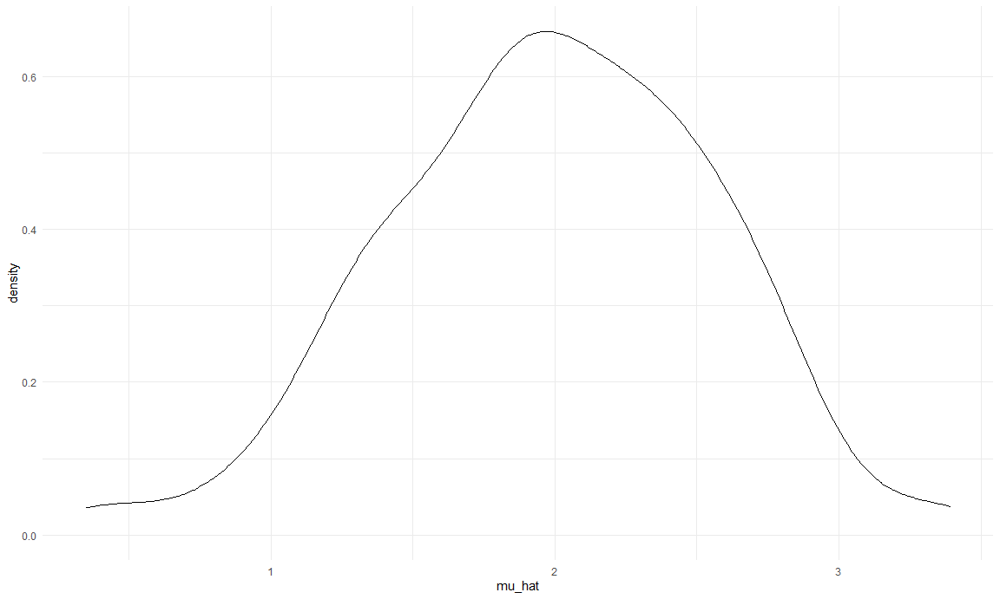

Simulation
================
Wenzhao Wu
11/9/2020

``` r
library(tidyverse)
```

    ## Warning: package 'tidyverse' was built under R version 4.0.3

    ## -- Attaching packages --------------------------------------- tidyverse 1.3.0 --

    ## v ggplot2 3.3.2     v purrr   0.3.4
    ## v tibble  3.0.3     v dplyr   1.0.2
    ## v tidyr   1.1.2     v stringr 1.4.0
    ## v readr   1.3.1     v forcats 0.5.0

    ## -- Conflicts ------------------------------------------ tidyverse_conflicts() --
    ## x dplyr::filter() masks stats::filter()
    ## x dplyr::lag()    masks stats::lag()

``` r
knitr::opts_chunk$set(
  fig.width = 12,
  fig.asp = .6,
  out.width = "90%"
)

theme_set(theme_minimal() + theme(legend.position = "bottom"))

options(
  ggplot2.continuous.colour = "viridis",
  ggplot2.continuous.fill = "viridis"
)

scale_colour_discrete = scale_colour_viridis_d
scale_fill_discrete = scale_fill_viridis_d

set.seed(1)
```

This is the function.

``` r
sim_mean_sd = function(n, mu = 2, sigma = 3) {
  
  sim_data = tibble(
    x = rnorm(n, mean = mu, sd = sigma),
  )
  
  sim_data %>% 
    summarize(
      mu_hat = mean(x),
      sigma_hat = sd(x)
    )
}
```

Use the function to simulate.

``` r
output = vector("list", 100)

for (i in 1:100) {
  output[[i]] = sim_mean_sd(30)
}

sim_results = bind_rows(output)
```

Let’s use a loop function.

``` r
sim_results = 
  rerun(100, sim_mean_sd(30, 2, 3)) %>% 
  bind_rows()
```

Let’s look at the results.

``` r
sim_results %>% 
  ggplot(aes(x = mu_hat)) + 
  geom_density()
```


