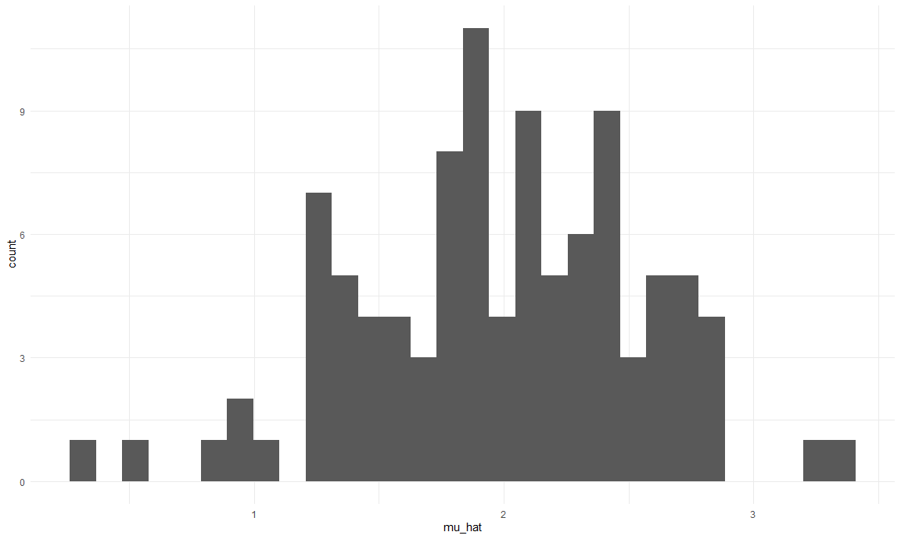

Simulation
================
Wenzhao Wu
11/9/2020

``` r
library(tidyverse)
```

    ## Warning: package 'tidyverse' was built under R version 4.0.3

    ## -- Attaching packages --------------------------------------- tidyverse 1.3.0 --

    ## v ggplot2 3.3.2     v purrr   0.3.4
    ## v tibble  3.0.3     v dplyr   1.0.2
    ## v tidyr   1.1.2     v stringr 1.4.0
    ## v readr   1.3.1     v forcats 0.5.0

    ## -- Conflicts ------------------------------------------ tidyverse_conflicts() --
    ## x dplyr::filter() masks stats::filter()
    ## x dplyr::lag()    masks stats::lag()

``` r
knitr::opts_chunk$set(
  fig.width = 12,
  fig.asp = .6,
  out.width = "90%"
)

theme_set(theme_minimal() + theme(legend.position = "bottom"))

options(
  ggplot2.continuous.colour = "viridis",
  ggplot2.continuous.fill = "viridis"
)

scale_colour_discrete = scale_colour_viridis_d
scale_fill_discrete = scale_fill_viridis_d

set.seed(1)
```

This is the function.

``` r
sim_mean_sd = function(n, mu = 2, sigma = 3) {
  
  sim_data = tibble(
    x = rnorm(n, mean = mu, sd = sigma),
  )
  
  sim_data %>% 
    summarize(
      mu_hat = mean(x),
      sigma_hat = sd(x)
    )
}
```

Use the function to simulate.

``` r
output = vector("list", 100)

for (i in 1:100) {
  output[[i]] = sim_mean_sd(30)
}

sim_results = bind_rows(output)
```

Let’s use a loop function.

``` r
sim_results = 
  rerun(100, sim_mean_sd(30, 2, 3)) %>% 
  bind_rows()
```

Let’s look at the results.

``` r
sim_results %>% 
  ggplot(aes(x = mu_hat)) + 
  geom_histogram()
```

    ## `stat_bin()` using `bins = 30`. Pick better value with `binwidth`.



Let’s try other samole sizes

``` r
n_list = 
  list(
    "n_30"  = 30, 
    "n_60"  = 60, 
    "n_120" = 120, 
    "n_240" = 240)

output = vector("list", length = 4)

for (i in 1:4) {
  output[[i]] = rerun(100, sim_mean_sd(n_list[[i]])) %>% 
    bind_rows
}
```

``` r
sim_results = 
  tibble(sample_size = c(30, 60, 120, 240)) %>% 
  mutate(
    output_lists = map(.x = sample_size, ~rerun(100, sim_mean_sd(n = .x))),
    estimate_dfs = map(output_lists, bind_rows)) %>% 
  select(-output_lists) %>% 
  unnest(estimate_dfs)
```

Do some data frame things.

``` r
sim_results %>% 
  mutate(
    sample_size = str_c("n = ", sample_size),
    sample_size = fct_inorder(sample_size)) %>% 
  ggplot(aes(x = sample_size, y = mu_hat, fill = sample_size)) + 
  geom_violin()
```


``` r
sim_results %>% 
  pivot_longer(
    mu_hat:sigma_hat,
    names_to = "parameter", 
    values_to = "estimate") %>% 
  group_by(parameter, sample_size) %>% 
  summarize(
    emp_mean = mean(estimate),
    emp_var = var(estimate)) %>% 
  knitr::kable(digits = 3)
```

    ## `summarise()` regrouping output by 'parameter' (override with `.groups` argument)

| parameter  | sample\_size | emp\_mean | emp\_var |
| :--------- | -----------: | --------: | -------: |
| mu\_hat    |           30 |     1.969 |    0.354 |
| mu\_hat    |           60 |     1.987 |    0.154 |
| mu\_hat    |          120 |     1.979 |    0.070 |
| mu\_hat    |          240 |     2.014 |    0.032 |
| sigma\_hat |           30 |     3.003 |    0.155 |
| sigma\_hat |           60 |     2.945 |    0.062 |
| sigma\_hat |          120 |     2.976 |    0.031 |
| sigma\_hat |          240 |     3.017 |    0.014 |
